<h3><div align="center">Telegram 转发器 | Telegram Forwarder</div>

---

<div align="center">

[][docker-url] [](https://github.com/Heavrnl/TelegramForwarder/blob/main/LICENSE)

[docker-url]: https://hub.docker.com/r/heavrnl/telegramforwarder

</div>

## 📋 目录

- [简介](#简介)
- [特性](#特性)
- [快速开始](#快速开始)
  - [准备工作](#1-准备工作)
  - [配置环境](#2-配置环境)
  - [启动服务](#3-启动服务)
- [使用指南](#使用指南)
  - [基础使用示例](#基础使用示例)
  - [特殊使用场景示例](#特殊使用场景示例)
- [功能详解](#功能详解)
  - [过滤流程](#过滤流程)
  - [设置说明](#设置说明)
- [AI 功能](#ai-功能)
  - [配置方法](#配置方法)
  - [AI 处理](#ai-处理能力)
  - [定时总结](#定时总结)
  - [自定义模型](#自定义模型)
- [特殊功能](#特殊功能)
  - [链接转发功能](#链接转发功能)
  - [与通用论坛屏蔽插件联动](#与通用论坛屏蔽插件联动)
- [命令列表](#命令列表)
- [捐赠](#捐赠)
- [开源协议](#开源协议)

## 简介
Telegram 转发器是一个消息转发工具，只需要你的账号加入频道/群聊即可以将指定聊天中的消息转发到其他聊天，不需要bot进入对应的频道/群组即可监听。可用于**信息流整合过滤**，**消息提醒**，**内容收藏**等多种场景。

## 特性

- 🔄 **多源转发**：支持从多个来源转发到指定目标
- 🔍 **关键词过滤**：支持白名单和黑名单模式
- 📝 **正则匹配**：支持正则表达式匹配目标文本
- 📋 **内容修改**：支持多种方式修改消息内容
- 🤖 **AI 处理**：支持使用各大厂商的AI接口
- 🔗 **联动同步**：支持与[通用论坛屏蔽插件](https://github.com/heavrnl/universalforumblock)联动同步，实现三端屏蔽

## 快速开始

### 1. 准备工作

1. 获取 Telegram API 凭据：
   - 访问 https://my.telegram.org/apps
   - 创建一个应用获取 `API_ID` 和 `API_HASH`

2. 获取机器人 Token：
   - 与 @BotFather 对话创建机器人
   - 获取机器人的 `BOT_TOKEN`

3. 获取用户 ID：
   - 与 @userinfobot 对话获取你的 `USER_ID`

### 2. 配置环境

新建文件夹
```bash
mkdir ./TelegramForwarder && cd ./TelegramForwarder
```
新建`.env`文件，填写参数，或者直接下载仓库的`.env.example`文件
```bash
wget https://raw.githubusercontent.com/Heavrnl/TelegramForwarder/refs/heads/main/.env.example -O .env
```
```ini
# Telegram API 配置 (从 https://my.telegram.org/apps 获取)
API_ID=
API_HASH=

# 用户账号登录用的手机号 (格式如: +8613812345678)
PHONE_NUMBER=

# Bot Token
BOT_TOKEN=

# 用户ID (从 @userinfobot 获取)
USER_ID=

# 最大媒体文件大小限制（单位：MB），不填或0表示无限制
MAX_MEDIA_SIZE=15

# 是否开启调试日志 (true/false)
DEBUG=false

# 数据库配置
DATABASE_URL=sqlite:///./db/forward.db

# UI 布局配置
AI_MODELS_PER_PAGE=10
KEYWORDS_PER_PAGE=10
SUMMARY_TIME_ROWS=10  
SUMMARY_TIME_COLS=6
DELAY_TIME_ROWS=10
DELAY_TIME_COLS=6

# 默认AI模型
DEFAULT_AI_MODEL=gemini-2.0-flash

# OpenAi API Key
# 留空使用官方接口 https://api.openai.com/v1
OPENAI_API_KEY=your_openai_api_key
OPENAI_API_BASE=  

# Claude API Key
# 默认使用官方接口
CLAUDE_API_KEY=your_claude_api_key

# Gemini API Key
# 默认使用官方接口
GEMINI_API_KEY=your_gemini_api_key

# DeepSeek API Key
# 留空使用官方接口 https://api.deepseek.com/v1
DEEPSEEK_API_KEY=your_deepseek_api_key
DEEPSEEK_API_BASE=  

# Qwen API Key
# 留空使用官方接口 https://dashscope.aliyuncs.com/compatible-mode/v1
QWEN_API_KEY=your_qwen_api_key
QWEN_API_BASE=  

# Grok API Key
# 留空使用官方接口 https://api.x.ai/v1
GROK_API_KEY=your_grok_api_key
GROK_API_BASE=     

# 默认AI提示词
DEFAULT_AI_PROMPT=请将以下内容翻译成自然流畅的中文，除此之外不需要更改任何内容。

# 默认AI总结提示词
DEFAULT_SUMMARY_PROMPT=请总结以下频道/群组24小时内的消息。
# 默认总结时间
DEFAULT_SUMMARY_TIME=07:00
# 默认时区
DEFAULT_TIMEZONE=Asia/Shanghai

# AI总结每次爬取消息数量
SUMMARY_BATCH_SIZE=20
# AI总结每次爬取消息间隔时间（秒）
SUMMARY_BATCH_DELAY=2


######### 扩展内容 #########

# 是否开启与通用论坛屏蔽插件服务端的同步服务 (true/false)
UFB_ENABLED=false
# 服务端地址
UFB_SERVER_URL=
# 用户API
UFB_TOKEN=

```

新建 `docker-compose.yml` 文件，内容如下：

```yaml
services:
  telegram-forwarder:
    image: heavrnl/telegramforwarder:latest
    container_name: telegram-forwarder
    restart: unless-stopped
    volumes:
      - ./db:/app/db
      - ./.env:/app/.env
      - ./sessions:/app/sessions
      - ./temp:/app/temp
      - ./ufb/config:/app/ufb/config
      - ./config:/app/config
    stdin_open: true
    tty: true
```

### 3. 启动服务

首次运行（需要验证）：

```bash
docker-compose run -it telegram-forwarder
```
CTRL+C 退出容器

修改 docker-compose.yml 文件，修改 `stdin_open: false` 和 `tty: false`

后台运行：
```bash
docker-compose up -d
```

## 使用指南

### 基础使用示例

假设订阅了频道 "TG 新闻" (https://t.me/tgnews) 和 "TG 阅读" (https://t.me/tgread) ，但想过滤掉一些不感兴趣的内容：

1. 创建一个 Telegram 群组/频道（例如："My TG Filter"）
2. 将机器人添加到群组/频道，并设置为管理员
3. 在**新创建**的群组/频道中发送命令：
   ```bash
   /bind https://t.me/tgnews 或者 /bind "TG 新闻"
   /bind https://t.me/tgread 或者 /bind "TG 阅读"
   ```
4. 设置消息处理模式：
   ```bash
   /settings
   ```
   选择要操作的对应频道的规则，根据喜好设置
   
   特别说明：
   - 如果对消息需要进行二次中转处理，可以开启`删除原消息`
   - 预览模式：开启后，会对消息第一条链接进行预览

5. 添加屏蔽关键词：
   ```bash
   /add 广告 推广 '这是 广告'
   ```

6. 如果发现转发的消息格式有问题（比如有多余的符号），可以使用正则表达式处理：
   ```bash
   /replace \*\*
   ```
   这会删除消息中的所有 `**` 符号

>注意：以上增删改查操作，只对第一个绑定的规则生效，示例里是TG 新闻。若想对TG 阅读进行操作，需要先使用`/settings(/s)`，选择TG 阅读，再点击"应用当前规则"，就可以对此进行增删改查操作了。也可以使用`/add_all(/aa)`，`/replace_all(/ra)`等指令同时对两条规则生效

这样，你就能收到经过过滤和格式化的频道消息了

### 特殊使用场景示例
TG频道的部分消息由于文字嵌入链接，点击会让你确认再跳转，例如nodeseek的官方通知频道

频道的原始消息格式
```
[**贴子标题**](https://www.nodeseek.com/post-xxxx-1)
```

可以对通知频道的转发规则**依次**使用以下指令
```
/replace \*\*
/replace \[(?:\[([^\]]+)\])?([^\]]+)\]\(([^)]+)\) [\1]\2\n(\3)
/replace \[\]\s*
```
最后所有转发过来的消息都会变成以下格式，这样直接点击链接就无需确认跳转了

```
贴子标题
(https://www.nodeseek.com/post-xxxx-1)
```

## 功能详解

### 过滤流程


首先要清楚消息过滤顺序，括号里对应设置里的选项：

```mermaid
flowchart TD
    A["延迟处理过滤器(延迟处理)"] --> B["关键字过滤器(对应过滤模式/过滤关键字时是否附带发送者名称和ID)"]
    B --> C["替换过滤器(替换模式)"]
    C --> D["AI处理过滤器(使用AI处理消息)"]
    D --> E["信息过滤器(添加原始链接/发送者/时间)"]
    E --> F["媒体过滤器(处理媒体内容，对应.env里的MAX_MEDIA_SIZE)"]
    F --> J{"处理模式判断(根据规则配置判断后续处理方式)"}
    J -->|编辑模式| G["编辑过滤器(编辑消息)"]
    J -->|发送模式| H["发送过滤器(发送消息，对应预览模式/消息格式/转发方式)"]
    G --> I["删除原始消息过滤器(删除原始消息)"]
    H --> I

    classDef filter fill:#f5f5f5,stroke:#333,stroke-width:1px;
    class A,B,C,D,E,F,G,H,I filter;
    classDef decision fill:#f5f5f5,stroke:#333,stroke-width:1px;
    class J decision;
```



### 设置说明

以下对设置选项进行说明
| 设置选项 | 说明 |
|---------|------|
| 应用当前规则 | 选择后，关键字指令(/add,/remove_keyword,/list_keyword等)和替换指令(/replace,/list_replace等)的增删改查导入导出将作用于当前规则 |
| 是否启用规则 | 选择后，当前规则将被启用，否则将被禁用 |
| 当前关键字添加模式 | 点击可切换黑/白名单模式，由于黑白名单是分开处理的，需要手动切换 |
| 过滤关键字时是否附带发送者名称和ID | 启用后，过滤关键字时会包含发送者名称和ID信息(不会添加到实际消息中)，可用于针对特定用户进行过滤 |
| 处理模式 | 可切换编辑/转发模式。编辑模式下会直接修改原消息；转发模式下会将处理后的消息转发到目标聊天。注意:编辑模式仅适用于你是管理员的频道消息或群组中自己发送的消息 |
| 过滤模式 | 可切换仅黑名单/仅白名单/先黑后白/先白后黑模式。由于黑白名单分开存储，可根据需要选择不同的过滤方式 |
| 转发模式 | 可切换用户/机器人模式。用户模式下使用用户账号转发消息；机器人模式下使用机器人账号发送消息 |
| 替换模式 | 启用后将根据已设置的替换规则对消息进行处理 |
| 消息格式 | 可切换Markdown/HTML格式，在最终发送阶段生效，一般使用默认的Markdown即可 |
| 预览模式 | 可切换开启/关闭/跟随原消息。开启后会预览消息中的第一个链接，默认跟随原消息的预览状态 |
| 原始发送者/原始链接/发送时间 | 启用后会在消息发送时添加这些信息，默认关闭 |
| 延时处理 | 启用后会按设定的延迟时间重新获取原消息内容，适用于频繁修改消息的频道/群组 |
| 删除原始消息 | 启用后会删除原消息，使用前请确认是否有删除权限 |


### AI 功能

项目内置了强大的 AI 处理功能，可以帮你：
- 自动翻译外语内容
- 定时总结群组消息
- 智能过滤广告信息
- 自动为内容打标签
- 以及更多...

#### 配置方法

1. 在 `.env` 文件中配置你的 AI 接口：
```ini
# OpenAI API
OPENAI_API_KEY=your_key
OPENAI_API_BASE=  # 可选，默认官方接口

# Claude API
CLAUDE_API_KEY=your_key

# 其他支持的接口...
```

2. 在转发规则的设置中点击「AI 设置」，你可以：
- 开启/关闭 AI 处理
- 选择使用的 AI 模型
- 自定义处理提示词
- 设置定时总结
- 调整总结时间和提示词

每个转发规则都可以独立配置不同的 AI 处理方案。

#### AI 处理

#### 定时总结

开启定时总结后，机器人会在指定时间（默认每天早上 7 点）自动总结过去 24 小时的消息。

你可以：
- 在 `config/summary_time.txt` 中添加多个总结时间点
- 在 `.env` 中设置默认时区
- 自定义总结的提示词

> 注意：总结功能会消耗较多的 API 额度，请根据需要开启。

#### 自定义模型

想使用特定的 AI 模型？在 `config/ai_models.txt` 中添加即可。


## 特殊功能

### 链接转发功能

向bot发送消息链接，即可把那条消息转发到当前聊天窗口，无视禁止转发和复制的限制（虽然我们转发器本身的功能就无视该限制...

### 与通用论坛屏蔽插件联动
> https://github.com/heavrnl/universalforumblock

确保.env文件中已配置相关参数，在已经绑定好的聊天窗口中使用`/ufb_bind <论坛域名>`，即可实现三端联动屏蔽，使用`/ufb_item_change`切换要同步当前域名的主页关键字/主页用户名/内容页关键字/内容页用户名

## 命令列表

```bash
命令列表

基础命令
/start - 开始使用
/help(/h) - 显示此帮助信息

绑定和设置
/bind(/b) <聊天窗口链接/聊天窗口名字> - 绑定源聊天
/settings(/s) - 管理转发规则

关键字管理
/add(/a) <关键字> - 添加普通关键字
/add_regex(/ar) <正则表达式> - 添加正则表达式
/add_all(/aa) <关键字> - 添加普通关键字到所有规则
/add_regex_all(/ara) <正则表达式> - 添加正则关键字到所有规则
/list_keyword(/lk) - 列出所有关键字
/remove_keyword(/rk) <关键词1> [关键词2] - 删除关键字
/clear_all_keywords(/cak) - 清除当前规则的所有关键字
/clear_all_keywords_regex(/cakr) - 清除当前规则的所有正则关键字
/copy_keywords(/ck) <规则ID> - 复制指定规则的关键字到当前规则
/copy_keywords_regex(/ckr) <规则ID> - 复制指定规则的正则关键字到当前规则

替换规则管理
/replace(/r) <模式> [替换内容] - 添加替换规则
/replace_all(/ra) <模式> [替换内容] - 添加替换规则到所有规则
/list_replace(/lr) - 列出所有替换规则
/remove_replace(/rr) <序号> - 删除替换规则
/clear_all_replace(/car) - 清除当前规则的所有替换规则
/copy_replace(/cr) <规则ID> - 复制指定规则的替换规则到当前规则

导入导出
/export_keyword(/ek) - 导出当前规则的关键字
/export_replace(/er) - 导出当前规则的替换规则
/import_keyword(/ik) <同时发送文件> - 导入普通关键字
/import_regex_keyword(/irk) <同时发送文件> - 导入正则关键字
/import_replace(/ir) <同时发送文件> - 导入替换规则

UFB相关
/ufb_bind(/ub) <域名> - 绑定UFB域名
/ufb_unbind(/uu) - 解绑UFB域名
/ufb_item_change(/uic) - 切换UFB同步配置类型

提示
• 括号内为命令的简写形式
• 尖括号 <> 表示必填参数
• 方括号 [] 表示可选参数
• 导入命令需要同时发送文件
```

## 捐赠

如果你觉得这个项目对你有帮助，欢迎通过以下方式请我喝杯咖啡：

[](https://ko-fi.com/0heavrnl)

## 开源协议

本项目采用 [GPL-3.0](LICENSE) 开源协议，详细信息请参阅 [LICENSE](LICENSE) 文件。
